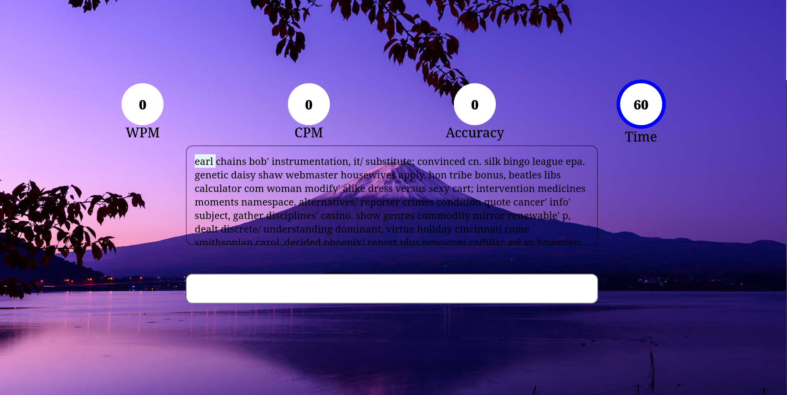

# Typing-Speed-Test ⌨️⏱️

## Description

A pure JavaScript typing speed test application built using the Modular Design Pattern for clean, maintainable code. This tool measures and analyzes your typing performance with:

### Key Features:

- Real-time metrics: Words Per Minute (WPM), Characters Per Minute (CPM), and accuracy tracking.
- Dynamic text generation: Randomized prompts for varied practice.
- Certificate generation: Downloadable proof of your results.
- Error highlighting: Visual feedback for mistakes during typing.

## Features ✨

### ⚡ Real-Time Metrics

- Words Per Minute (WPM): Track typing speed in standard words (5 characters = 1 word).
- Characters Per Minute (CPM): Measure raw keystroke speed.
- Accuracy Percentage: Calculates error-free typing precision.

### 🏆 Certificate Generation

- Download a PDF certificate with your score (WPM, CPM, Accuracy).
- Shareable results for social proof or progress tracking.

### 🔍 User-Friendly Tools

- Mistake highlighting during typing.
- Detailed post-test analytics.

## Screenshot



## Installation 💻

### Prerequisites

- Modern web browser (Chrome, Firefox, Edge, or Safari)
- Git (optional, for cloning)

### Quick Start

1. **Clone the repository**:

   ```bash
   git clone https://github.com/AbdallahAnass/Typing-Speed-Test.git
   ```

2. **Navigate to the directory**

   ```bash
   cd Typing-Speed-Test
   ```

3. **Launch the application**

   - Simply open the `index.html` file

## Technologies Used 🛠️

- Pure JavaScript (ES6+)
- Modular Design Pattern
- HTML5/CSS3
- [jsPDF](https://artskydj.github.io/jsPDF/docs/index.html) (for PDF generation)

## Contributing 🤝

Pull requests are welcome! For major changes, please open an issue first.

1. Fork the project
2. Create your feature branch ` (git checkout -b feature/AmazingFeature)`
3. Commit your changes `(git commit -m 'Add some AmazingFeature')`
4. Push to the branch `(git push origin feature/AmazingFeature)`
5. Open a Pull Request

## Contact 📧

Abdallah Anas - anasabdalla99@gmail.com

Project Link: https://github.com/AbdallahAnass/Typing-Speed-Test
